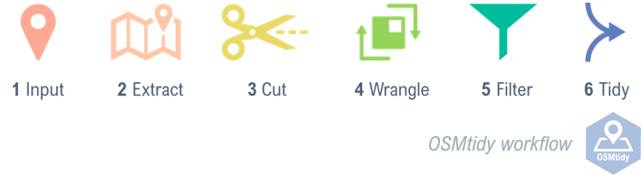
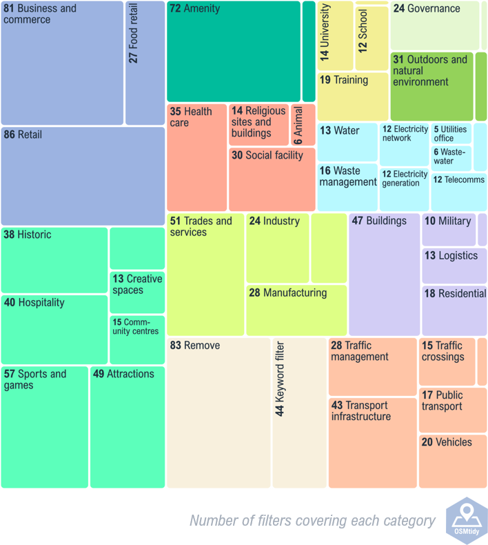

# OSMtidy

 

## Overview
OSMtidy is a software code, created in R. With OSMtidy, large messy OpenStreetMaps data can be quickly tidied into a streamlined dataset with a simple naming convention. OSMtidy can be applied at any scale, from a small village to cities the size of London.

**OSMtidy is for anyone who needs a concise yet complex geospatial dataset with a consistent naming convention.**

**Example application** The outputs provided by OSMtidy have expanded the scope and capability of the parent project (see Background). It is now being used to derive inputs for a subsequent COVID-19 recovery and response project. 

## OSMtidy workflow

The simple and easy to follow workflow consists of six steps: 

1.	**Input** A shapefile outlining the location
2.	**Extract** Spatial data – inside the shapefiles ‘bounding box’ – is extracted from [OpenStreetMaps](https://www.openstreetmap.org/) servers via the R package [osmdata](https://cran.r-project.org/web/packages/osmdata/index.html)
3.	**Cut** The extracted data is ‘cookie cutter’-ed to the shapefile extent
4.	**Wrangle** The data is transformed into a suitable format for filtering
5.	**Filter** The physical objects are filtered and renamed to follow a simple naming convention
6.	**Tidy** Collates the outputs to form a streamlined database of physical objects

&nbsp;

## Background
OSMtidy is being developed as part of the £1-million Water Resilient Cities project. The project looks to understand, quantify, and explore solutions to the challenge of climate change and adaptive water management. Designed to explore the impact of natural and anthropogenic hazards, one of the main outputs of the project is the Urban Systems Abstraction Hierarchy [Bedinger et al., 2020](https://doi.org/10.1029/2019EF001389). Effectively a type of systems map, the Urban Systems Abstraction Hierarchy captures the functional connections between the physical and abstract. Developed in a UK context, the Urban Systems Abstraction Hierarchy recognises 137 different physical objects in the urban environment. For application at the city-wide level, acquiring such data represented a major obstacle. In response, OSMtidy was developed, allowing large messy OpenStreetMaps data to be quickly tidied into a streamlined database of physical objects with a simple naming convention. 

## Acknowledgements 
The development of OSMtidy is funded by UKRI EPSRC as part of the *Water Resilient Cities project*, grant number EP/N030419/1, as well as an associated EPSRC Impact Acceleration Fund, *Urban system response and recovery: Development of an online tool to explore the impact of COVID-19*.

## Contributions & citation
**Author** Annie Visser-Quinn

**Filters development** Annie Visser-Quinn and Melissa Bedinger

**Contact** If you have any questions about using or running the code, or wish to access pre-filtered outputs for UK city locations, please contact a.visser-quinn@hw.ac.uk. 

**Please cite** Annie Visser-Quinn and Melissa Bedinger. (2020) OSMtidy V0.0.4, Edinburgh, Scotland. doi:10.5281/zenodo.3941990 
